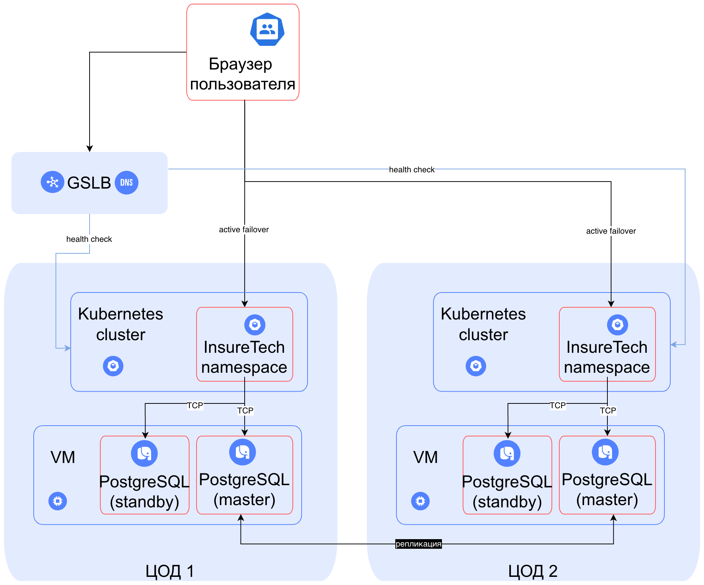

# Задание
1. **Определите стратегию масштабирования и отказоустойчивости.** Рассмотрите вертикальное и горизонтальное масштабирование для вашей системы. Оцените, какая стратегия будет эффективнее. Требуется ли использование дополнительных зон безопасности?
2. Если приняли решение деплоить приложение в нескольких зонах безопасности, то продумайте и отразите на схеме следующие вопросы:
    a. **Проработайте конфигурацию развёртывания приложения в Kubernetes.** Вы будете использовать независимые кластеры в каждой площадке или один растянутый? Оставьте на схеме комментарий с объяснением, почему вы выбрали тот или другой подход. 
    b. **Спланируйте балансировку нагрузки.** Опишите подход к балансировке нагрузки, который обеспечит распределение трафика между вашими сервисами и географически распредёленными серверами. Явно отразите на схеме все health check. 
    c. **Определите наиболее подходящую фейловер-стратегию.** Она должна отвечать заданным требованиям отказоустойчивости. Отразите её на схеме на уровне взаимодействия клиента с приложением. 
    d. **Определите конфигурацию базы данных.** Учитывая требования RTO и RPO, спроектируйте конфигурацию базы данных: определите, как вы будете обеспечивать репликацию данных и их резервное копирование. Если будете использовать конкретный фреймворк конфигурации кластера БД, отразите его на схеме.
3. **Определите, будете ли вы применять шардирование БД.** Отразите своё решение на схеме.

# Ход решения

Сейчас при падении базы данных будет долгий простой и ей необходимо дублирование - необходимо реализовать failover.
Для каждой базы данных подойдет вариант добавления синхронной реплики в том же ЦОДе, чтобы это не повлияло сильно на работу приложениения и не добавило сетевых задержек, а синхронность реплики гарантирует сохранность данных. 

Для монолитного приложения core-app обычно эффективнее вертикальное масштабирование, т.к. горизонтальное может начать дублировать тот функционал, который в этом не нуждается, что повлечет за собой ненужные затраты. 

Остальные же сервисы (client-info, ins-product-aggregator, ins-comp-settlement и веб приложение) отвечают за отдельные доменные области и хорошо отделены. При допущении, что они stateless  это позволяет масштабировать их горизонтально.

Дополнительно стоит задача независимости от гео расположения клиента. Это требует от нас задуматься о распределении копий серверов в разных ЦОДах для сокращения задержек. Это также поможет нам повысить отказоустойчивость приложения. Для этого мы можем использовать GSLB и Active-Active стратегию фейловера поскольку размер данных сравнительно небольшой (50GB) и мы можем себе позволить хранить дубликаты данных (стоимость хранения кратно меньше цены недоступности). Такое решения также поможет нам уменьшить сетевые задержки, т.к. не придется работать с шардами и ходить в другой ЦОД за данными. Будут сложности с задержками репликации между мастер нодами БД, но с учетом распределения юзеров по разным ЦОДам из-за геолокации, то она не должна быть критичной. 

Кластера Kubernetes тоже будут независимы, т.к. у нас уже получаются независимые системы. Этот подход снижает зависимость от сетевой связанности между ЦОД и от внутренних недостатков фейловер-механизмов в Kubernetes.

