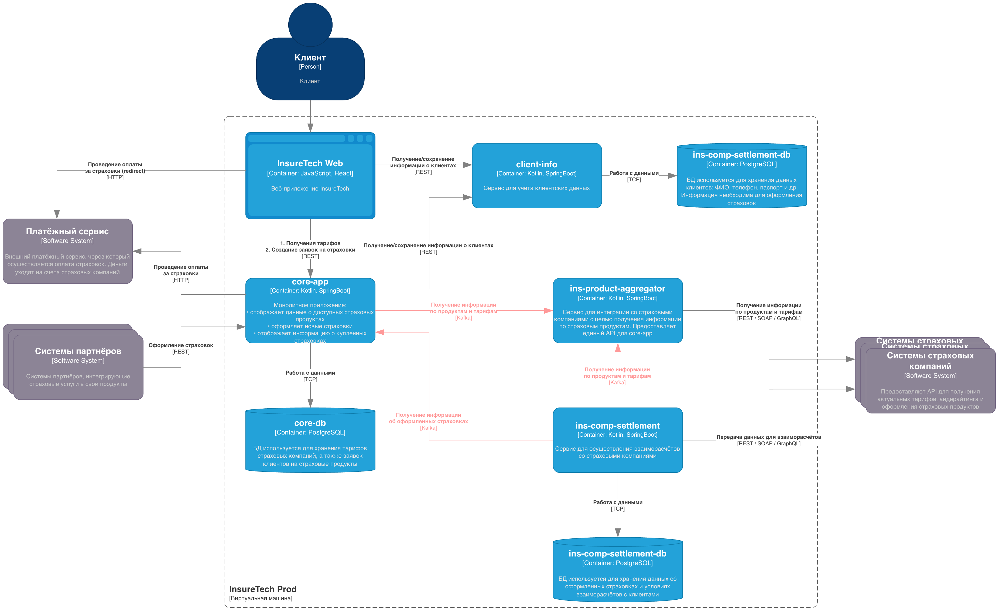

# Задание

Сервисы core-app и ins-comp-settlement получают данные о доступных продуктах через REST API сервиса ins-product-aggregator. В момент вызова он:

- запрашивает информацию из всех страховых компаний (сейчас их пять),
- агрегирует её в единый список,
- возвращает этот список в рамках того же синхронного запроса.

Чтобы ускорить работу сервисов, при изначальном проектировании команда решила хранить локальные реплики данных о продуктах и тарифах в сервисах core-app и ins-comp-settlement.

Сервис core-app осуществляет запрос к ins-product-aggregator раз в 15 минут, а ins-comp-settlement — раз в сутки (ночью), при формировании реестра оформленных страховок. Иногда команда сталкивается с ошибками взаимодействия между этими сервисами. Они связаны с задержками ответов или ошибками при взаимодействии с API страховых компаний.

Дополнительно сервис ins-comp-settlement раз в сутки осуществляет запрос в core-app по REST API для получения всех оформленных за день страховок. Эти данные он использует.

В ближайшее время InsureTech планирует подписать агентское соглашение ещё с пятью страховыми компаниями. Вам предстоит спроектировать решение, которое устранит текущие проблемы.

### Что нужно сделать

1. Проанализируйте текущую архитектуру. Создайте текстовый документ и напишите там список проблем и рисков, которые связаны с планируемым ростом нагрузки. Когда всё будет готово, загрузите документ в директорию **Task3** в рамках пул-реквеста.
2. Обновите [диаграмму контейнеров InsureTech](https://code.s3.yandex.net/software-architect/InsureTech_C4_сontainer-diagram.drawio.xml), предложив решения для выявленных вами рисков и проблем. При этом:
    
    - Не меняя декомпозицию функциональности между сервисами, подумайте, какие взаимодействия стоит переделать на Event-Streaming.
    - Решите, будете ли вы использовать паттерн Transactional Outbox.
    
    Когда схема будет готова, загрузите её в директорию **Task3** в рамках пул-реквеста..

# Решение

Проблемы текущего решения:
- Работа с устаревшими данными (для core-app до 15 минут, для ins-comp-settlement до суток)
- Избыточная нагрузка на сеть (гонять между сервисами полный пакет данных)
- При временной недоступности сети может пропустить обновление данных

Риски текущего решения:
- Оформление страховки по неактуальному продукту
- Оформление страховки по неактуальным условиям
- Невозможность оформления страховки, которая уже есть в core-app, а в ins-comp-settlement нет
- Прямая зависимость между поставщиком и потребителем

Предложение: создавать события обновления данных по продуктам страховок и по оформленным страховкам. Так сервисы потребители будут всегда иметь актуальные данные в своих сервисах и не будут иметь прямой зависимости от поставщика. Дополнительно это снизит нагрузку на базу данных. Паттерн transactional outbox для такого решения будет хорошим выбором, т.к. он будет гарантировать доставку в брокер сообщений at-least-once (при условии передачи timestamp не добавит проблем)

На итоговой диаграмме не стал рисовать отдельный брокер сообщений, т.к. это ухудшает видимость зависимостей. Вместо этого поменял используемую технологию с REST на Kafka.

