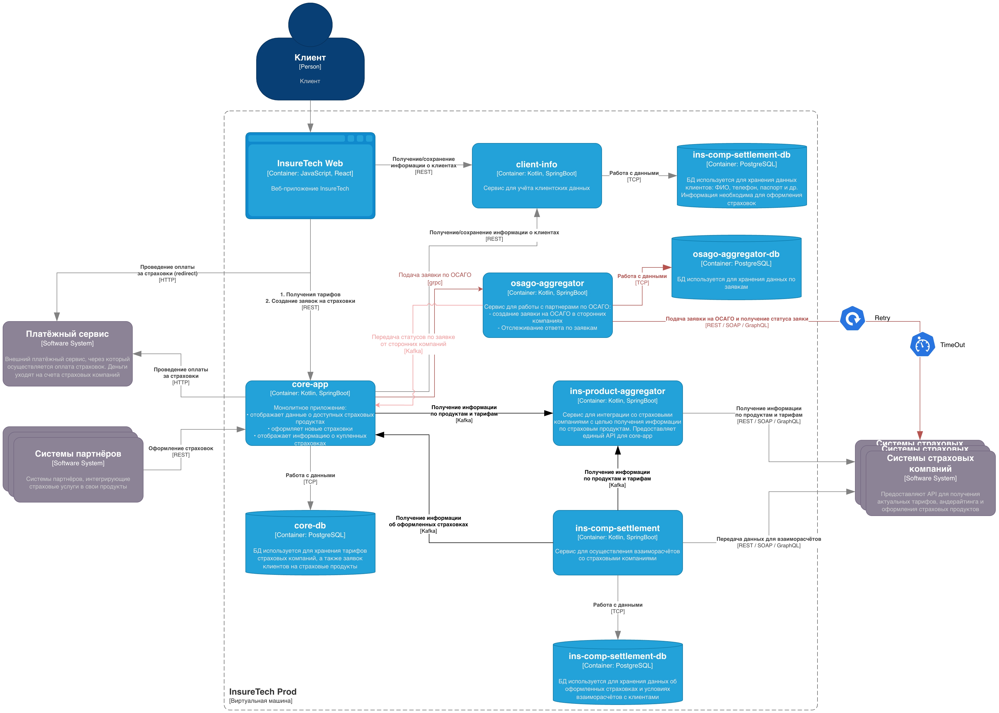

# Задание

Компания планирует вскоре запустить новый продукт: оформление ОСАГО онлайн. Пользовательский путь выглядит так: клиенту предлагается заполнить заявку с информацией о своём автомобиле, после этого сервис запрашивает у всех доступных страховых компаний предложения с условиями страхования под заявку клиента. Бизнесу важно, чтобы на экране пользователя предложения от каждой страховой компании отображались сразу, как только от неё пришёл ответ. Максимальное время ожидания решения от страховой компании — 60 секунд.

Все страховые компании предоставляют однотипные REST API с двумя эндпоинтами:

- создать заявку на ОСАГО,
- получить предложение по заявке.

Бизнес предполагает, что в пик нагрузки количество одновременных пользователей, создающих заявку на ОСАГО, может достигать 2,5 тысячи человек.

Вы обсудили задачу с командой разработки и приняли такие решения:

1. Сохранить подход, который использовался для получения данных о продуктах и тарифах из страховых компаний.
2. Выделить отдельный сервис для взаимодействия со страховыми компаниями — **osago-aggregator**.

Функциональная обязанность этого сервиса — отправка заявок в страховые компании и дальнейший опрос решений по ним для передачи результатов в core-app. Остальная функциональность, связанная с оформлением ОСАГО, остаётся на стороне бэкенда в core-app.

Теперь вам нужно проработать ещё несколько моментов, исходя из требований бизнеса. Доработайте схему, которая у вас получилась в третьем задании. Отразите на ней ваши решения по этим вопросам:

1. Проработайте реализацию osago-aggregator. Решите:
2. Требуется ли ему своё хранилище данных?
3. Какой API он предоставляет core-app?
4. Определите средство интеграции между сервисами core-app и osago-aggregator.
5. Подумайте над API для веб-приложения в core-app.
6. Определите средство интеграции между веб-приложением и core-app. Если будете использовать средство, отличное от REST, отразите интеграцию новой стрелкой.
7. В зависимости от выбранных средств интеграции подумайте, требуется ли где-то применение паттернов отказоустойчивости:
    
    - Rate Limiting,
    - Circuit Breaker,
    - Retry,
    - Timeout.
    
    Отобразите применение паттернов [на схеме](https://code.s3.yandex.net/software-architect/Обозначения%20паттерном%20отказоустойчивости.drawio.xml) с помощью обозначений из этой библиотеки.
    
8. Примите во внимание, что сервисы задеплоены в нескольких экземплярах. Подумайте, зависит ли ваше решение от этого.

Загрузите новый вариант схемы в директорию **Task4** в рамках пул-реквеста.

# Решение

Примерная пиковая нагрузка:
2500 RPS новых заявок
2500 * (5 текущих + 5 ожидается в будущем компаний) = 25000 RPS исходящих запросов на расчет заявок по ОСАГО

Детали решения:
osago-aggregator будет иметь grpc api для подачи заявок. Далее сервис ОСАГО делает запрос в каждый внешний сервиса партнера и получает внешний номер запроса с retry.  
Для возврата результата заявок логично использовать брокер сообщений, а клиенту выводить через websocket или через short polling.
Это более лучший вариант по сравнению с синхронными:
- Ждать таймаут 60 секунд (если упадет запрос, то все сброситься + долго держим HTTP соединение)
- Периодически опрашивать сервис ОСАГО (лишняя нагрузка на сеть между сервисами)

Далее я рассмотрел два варианта: через Redis и через PostgreSQL. Я бы выбрал первоначально через PostgreSQL и провел бы нагрузочное тестирование. Если упираемся в производительность базы, то реализовал бы через Redis (менее надежно с точки зрения хранения заявок, но можно продумать ретраи со стороны core-app для таких случаев).

## Решение через PostgreSQL:
Каждый из запросов кладем в таблицу requests со столбцами company, external_id, status, created_at

Далее каждый воркер получает пачку запросов через SELECT FOR UPDATE SKIP LOCKED. 
Примерная частота вызовов считается по формуле - вызывать Х раз, раз в N секунд, где X - количество воркеров, N - время опроса. Примерно 25 запросов раз в 10 секунд(с учетом параллели запросов)

Для всех истекших created_at проставляем status="timeout"
Для тех, что ответили отправляем сообщение в Кафку и проставляем "accept"/ "reject" (в таком порядке, чтобы гарантировать доставку ответа)

## Решение через Redis:
Каждый из запросов кладем в Redis Streams в канал с json сообщением {"request_id", "company", "external_id", "created_at"}

Каждый воркер читает по 100 сообщений
XREADGROUP GROUP osago-group worker-{pod-name} COUNT 100 BLOCK 0 STREAMS osago:requests >

Те что обработал отправляем сообщение в Кафку и выполняем XCLAIM (или истекшим)
XCLAIM osago:requests osago-group worker-2 IDLE 0 "1689234005111-0" "1689234007222-0"

## Итоговая диаграмма
